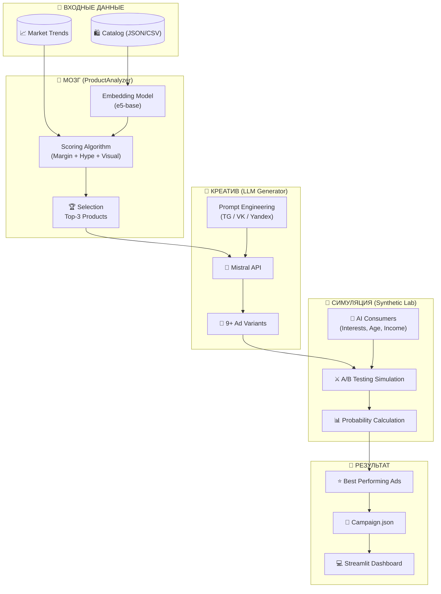

# 🚀 GENAI-4 — Autonomous Marketing Agent


> **Забудьте про интуицию. Доверьте маркетинг данным.**
> GENAI-4 — это автономный ИИ-агент, который анализирует товары, генерирует креативы и тестирует их на синтетической аудитории, прежде чем вы потратите хоть рубль реального бюджета.

---

## ⚡ О проекте

**GENAI-4** решает главную проблему малого e-commerce: **отсутствие экспертизы и бюджета на тесты**.

Вместо того чтобы гадать, какой текст "залетит", система создает виртуальную симуляцию рынка. Она "скармливает" объявления сотням ИИ-потребителей с разными психотипами, собирает статистику кликов и выдает готовый JSON для запуска кампании.

### 🔥 Ключевые возможности

* 🧠 **Умный анализ товара:** Использует `SentenceTransformer` (BERT-based) для оценки визуальной привлекательности, новизны и "хайповости" описания.
* ✍️ **Мультиканальная генерация:** Пишет тексты через **Mistral API**, адаптируя стиль под Telegram (коротко/эмодзи), VK (сторителлинг) и Yandex Ads (сухие факты).
* 👥 **Синтетическая аудитория:** Генерирует уникальных цифровых потребителей (возраст, интересы, паттерны поведения).
* 🎯 **Предиктивный скоринг:** Рассчитывает `Click Probability` и `Purchase Probability` на основе совпадения интересов бота и текста рекламы.
* 📊 **Готовый результат:** Выдает не просто текст, а полный JSON-файл кампании с рекомендациями и аналитикой.

---

## 🛠 Архитектура и Логика работы

Система работает как конвейер данных. Ниже представлена схема потоков данных внутри GENAI-4.


### ⚙️ Как это работает "под капотом":

1.  **Семантический скоринг:** Мы превращаем описание товара в векторы. Если вектор товара близок к вектору слов "яркий, стильный", товар получает баллы за визуал.
2.  **Генерация:** LLM получает жесткие инструкции (System Prompt), чтобы не писать "воду", а использовать триггеры продаж (FOMO, выгода).
3.  **Виртуальный краш-тест:**
    * *Бот "Студент" (денег мало, любит скидки)* увидит слово "Акция" -> **Клик!**
    * *Бот "Премиум" (ценит качество)* увидит "Дешево" -> **Игнор.**
    * Система агрегирует эти реакции и выбирает победителя.

---
### 2. ЧАСТЬ 2: Структура, Быстрый старт, Интерфейс и Таблица соответствия ТЗ

## 📂 Структура проекта
```markdown
project_creative/
├── 📄 app.py              # Веб-интерфейс (Streamlit)
├── 📄 main.py             # Ядро: оркестрация генерации и тестирования
├── 📄 productAnalyzer.py  # Модуль анализа (Embeddings + Trends)
├── 📄 promt.py            # Работа с LLM (Mistral Client + Промпты)
├── 📄 products.json       # Пример входящего каталога
├── 📄 requirements.txt    # Зависимости
└── 📄 README.md           # Документация
```
## 🚀 Быстрый старт

### 1. Клонирование
```bash
git clone [https://github.com/dext01/project_creative.git](https://github.com/dext01/project_creative.git)
cd project_creative
```
### 2. Окружение
```bash
python -m venv .venv
# Для Windows:
.venv\Scripts\activate
# Для Mac/Linux:
source .venv/bin/activate
```
### 3. Зависимости
```bash

pip install -r requirements.txt
```
### 4. Настройка ключей

#### Для полноценной работы (не в режиме Mock) нужен ключ от Mistral AI:
```bash

# Mac/Linux
export MISTRAL_API_KEY="ваш_ключ_mistral"
# Windows (PowerShell)
$env:MISTRAL_API_KEY="ваш_ключ_mistral"
```
### 5. Запуск
```bash

streamlit run app.py
```
